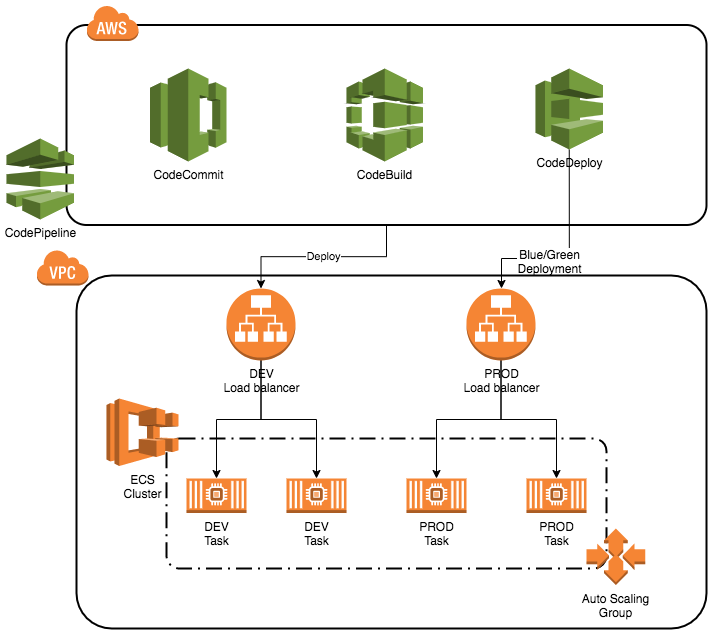
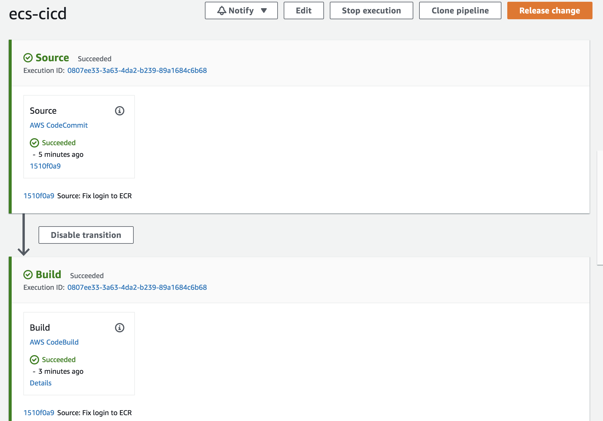
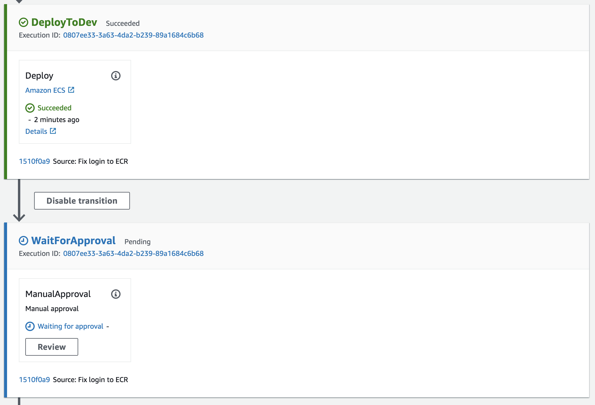
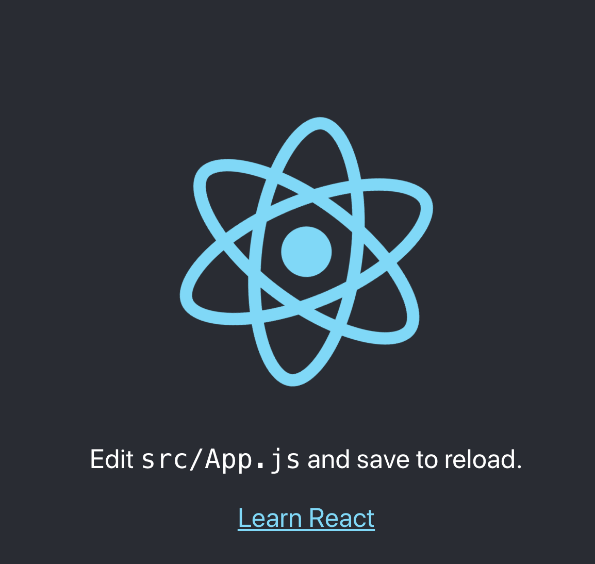
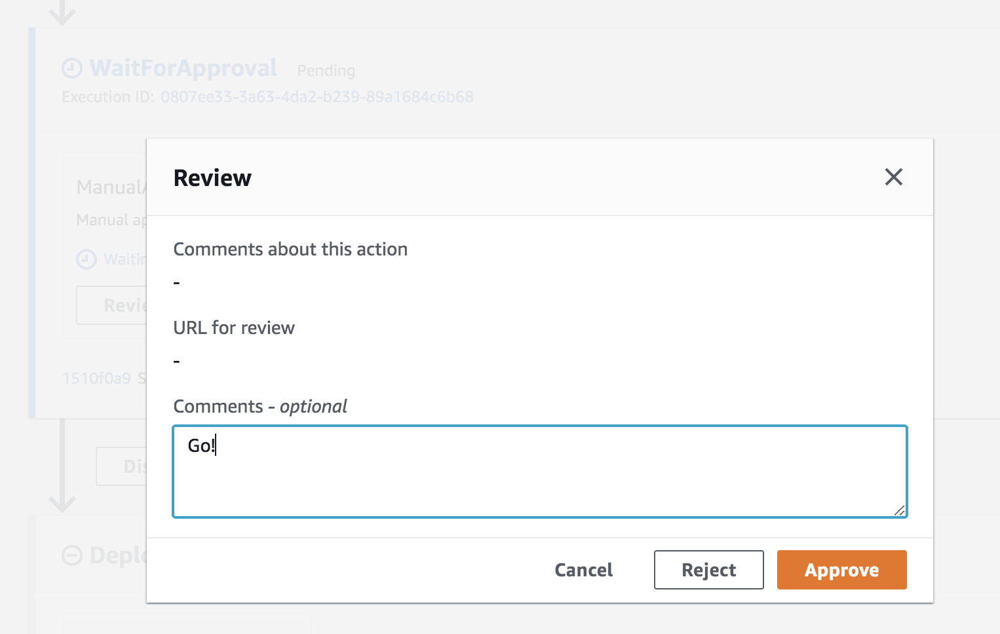
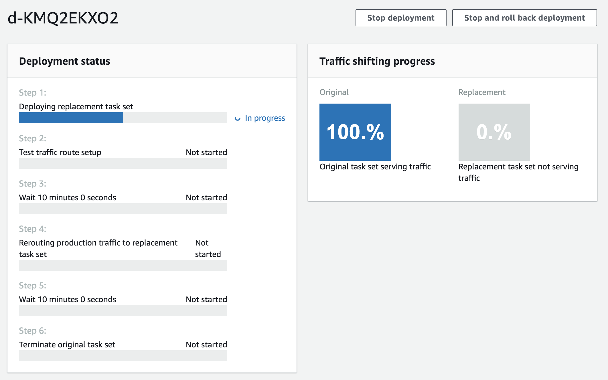
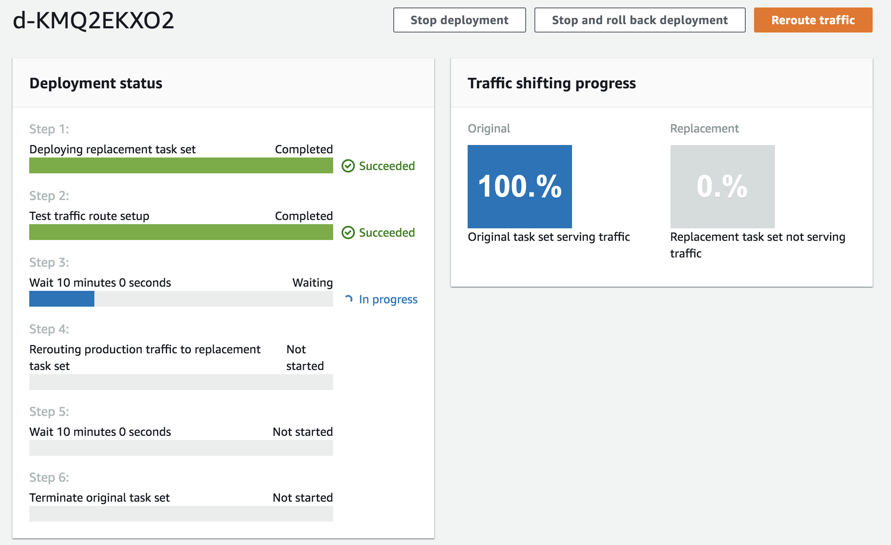
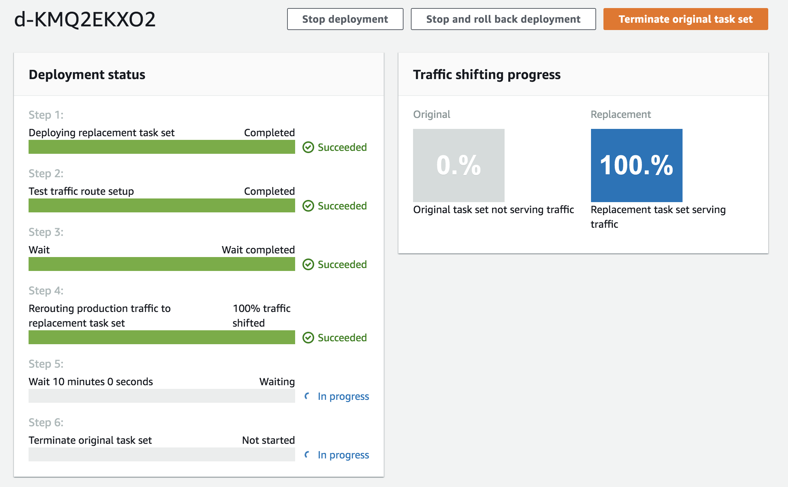
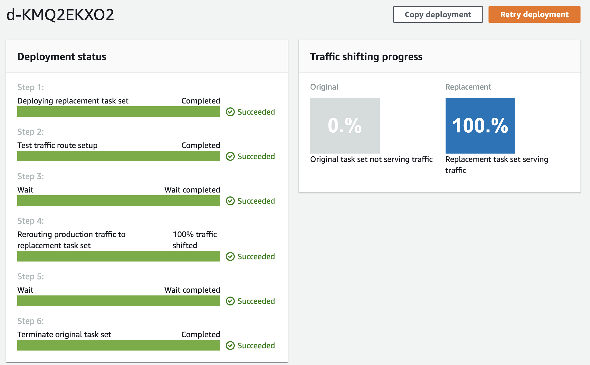

# Introducción a CI/CD con AWS

Este proyecto utiliza el template de [Create React App](https://github.com/facebook/create-react-app) como ejemplo de una aplicación desplegada en ECS a través de un flujo de integración y entrega continua.

## Requisitos

- Cuenta de AWS
- Usuario IAM con permisos de administrador
- VPC y subnets por default en la región seleccionada
- Terraform 0.12

## Servicios

- CodeCommit
- CodeBuild
- CodeDeploy
- CodePipeline
- ECS
- ECR

## Diagrama



## Instrucciones

### Creación de infraestructura

1. Clona este repositorio:

```sh
git clone https://github.com/eloyvega/ecs-cicd.git
cd ecs-cicd
```

2. Revisa las configuraciones por default en `infra/terraform.tfvars`. En este archivo puedes modificar la región y los valores por default de la infraestructura.

3. Usa Terraform de la siguiente forma para crear los recursos en AWS:

```sh
cd infra
terraform init
terraform apply
```

Confirma con: `yes`

Al terminar, Terraform imprime los valores de los DNS de los Load Balancer de desarrollo y producción así como la URL del repositorio de CodeCommit. Más adelante utilizaremos estos valores.

### Despliegue en desarrollo

Para disparar la ejecución de CodePipeline hay que actualizar el código de la aplicación en CodeCommit.

1. Configura tu Git para utilizar el Credential Helper de AWS:

```sh
git config --global credential.helper '!aws codecommit credential-helper $@'
git config --global credential.UseHttpPath true
```

2. Agrega un nuevo `remote` al repositorio Git y actualiza el repositorio en CodeCommit:

```
git remote add codecommit $(terraform output repo_url)
git push -u codecommit master
```

3. En la consola de AWS, visita el servicio CodePipeline y entra al pipeline del proyecto (por default, `ecs-cicd`). El comando de `git push` actualizó el código en CodeCommit y a su vez CodePipeline inició la construcción de la imagen de Docker utilizando CodeBuild.



Una vez terminado la etapa de `Build`, la imagen de Docker ya se encuentra en ECR y se inicia el despliegue en el entorno de desarrollo:



4. Cuando la etapa `DeployToDev` se encuentra en verde puedes visitar el DNS del Load Balancer de desarrollo para verificar que la aplicación se encuentra en ejecución:

```sh
terraform output load_balancers
```

Ejemplo de salida:

```
{
  "development" = "ecs-cicd-dev-0000000.us-east-1.elb.amazonaws.com"
  "production" = "ecs-cicd-prod-0000000.us-east-1.elb.amazonaws.com"
}
```

Al visitar la URL de `development` puedes ver la página de ejemplo de `Create React App`:



### Despliegue en producción

1. En la ejecución de CodePipeline, hay una etapa de aprobación manual para el despliegue en producción. Da click en `Review`, escribe un mensaje y da click en `Approve`:



2. Con esto se dispara la ejecución de la etapa `DeployToProd` que utiliza CodeDeploy para hacer un despliegue con la estrategia **blue/green**. Da click en el link `Details` para ir a la consola del despligue:

En la primer etapa vemos el aprovisionamiento de nuevas tareas de ECS:



Cuando las nuevas tareas se encuentran listas para recibir tráfico, se activa el Listener de tráfico de prueba:



Visita el DNS del balanceador de producción y agrega el puerto `:8080`. Deberías ver la aplicación en ejecución.

Después de 10 minutos, CodeDeploy manda el tráfico al puerto de producción (o puedes dar click a `Reroute traffic` para acelerar el proceso):



Después de 10 minutos, CodeDeploy terminará el set de tareas originales y marcará el despliegue como exitoso (puedes acelerar este proceso dando click a `Terminate original task set`). También puedes hacer un _Rollback_ si el despliegue no es exitoso y CodeDeploy regresará el tráfico de producción al set de tareas originales.

Visita el DNS del balanceador de producción para ver la aplicación en ejecución.

Ejemplo de un despliegue exitoso:



## Extras

Para ver el flujo de un cambio puedes cambiar el contenido del archivo `src/App.js` y hacer un nuevo commit y push en Git. Esto inicia el pipeline y puedes seguir el cambio a través del ambiente de desarrollo, producción en test y producción.

También puedes cambiar el valor de `deployment_strategy` en el archivo `infra/terraform.tfvars` y explorar las diferentes opciones para hacer despliegues controlados en producción.

## Destruir recursos

Recuerda eliminar los recursos creados con Terraform para evitar cargos en tu cuenta de AWS:

```sh
cd infra
terraform destroy
```

Confirma con: `yes`

## Feedback

Deja un issue en GitHub si tienes algún problema para ejecutar este ejemplo.
